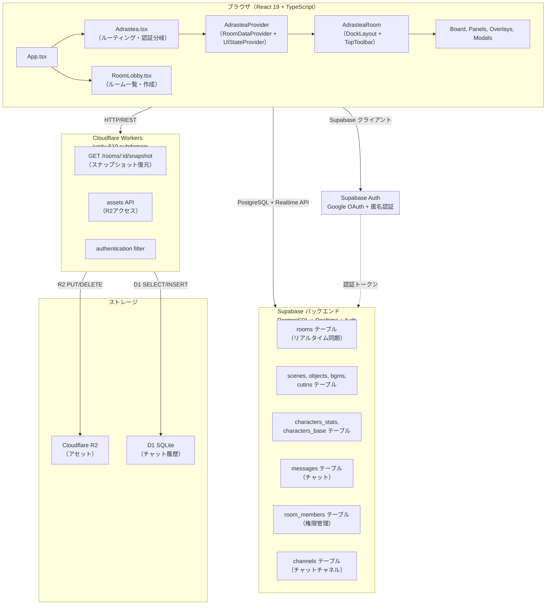
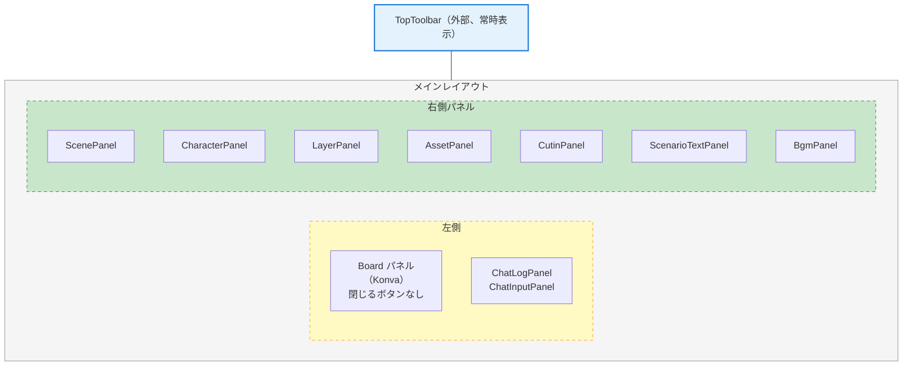

# Adrastea アーキテクチャ仕様書

TRPGオンラインセッション向け盤面共有ツール。マップ・駒・シーン・キャラクター・オブジェクト・BGM・カットインをリアルタイム共有。

## 1. システム全体構成



デプロイ：Vercel（フロント） + Supabase（バックエンド） + Cloudflare（Worker/R2/D1）

## 2. Reactコンテキスト設計（3層構造）

### 2.1 Overall Integration

`AdrasteaContext.tsx` で RoomDataProvider と UIStateProvider を統合し、AdrasteaContextValue を提供。

```
AdrasteaProvider (AdrasteaContext.tsx)
├─ RoomDataProvider
│  ├─ useAdrastea（pieces, room）
│  ├─ useAdrasteaChat（messages）
│  ├─ useScenes（scenes）
│  ├─ useCharacters（characters）
│  ├─ useObjects（allObjects, activeObjects）
│  ├─ useBgms（bgms）
│  └─ useChannels（channels）
│
└─ UIStateProvider
   ├─ UI状態（editingScene, editingCharacter等）
   ├─ Dockview API管理
   ├─ グリッド可視化
   └─ マスターボリューム（localStorage）
```

### 2.2 RoomDataProvider の責務

Supabase からのサーバーデータフェッチと楽観的UI更新を担当。

- 部屋・シーン・駒・キャラ・オブジェクト・BGM・メッセージ の CRUD
- Supabase Realtime subscription での通信
- ローカルオーバーライドによる即座の UI 反映
- 楽観値の自動クリア（サーバー値が到達後）

主要フック：

| フック | 役割 |
|-------|------|
| `useAdrastea` | rooms, pieces |
| `useAdrasteaChat` | messages, channels |
| `useScenes` | scenes (作成/更新/削除/並べ替え) |
| `useCharacters` | characters_stats + characters_base |
| `useObjects` | objects (複数シーン対応) |
| `useBgms` | bgms (再生状態管理) |
| `useChannels` | chat channels |

### 2.3 UIStateProvider の責務

ユーザーインタラクション・エディタ状態を管理。

- 編集中のエンティティ: editingScene, editingCharacter, editingObjectId, editingCutin, editingBgmId, editingScenarioTextId
- パネル選択状態: panelSelection（層パネルで複数オブジェクト選択）
- Dockview API 管理
- グリッド表示/非表示トグル
- マスターボリューム・BGM ミュート（localStorage 永続化）
- clearAllEditing()：全編集状態リセット

### 2.4 AdrasteaContextValue インターフェース

RoomDataProvider + UIStateProvider をマージし、以下を提供：

```typescript
export interface AdrasteaContextValue {
  // リード・オンリー
  roomId: string;
  roomRole: 'owner' | 'sub_owner' | 'user' | 'guest';

  // Room データ
  room: Room | null;
  updateRoom: (updates: Partial<Room>) => Promise<void>;

  // シーン
  scenes: Scene[];
  activeScene: Scene | null;
  addScene: (data: Partial<Scene>, duplicateFromSceneId?: string) => Promise<void>;
  updateScene: (id: string, updates: Partial<Scene>) => Promise<void>;
  removeScene: (id: string) => Promise<void>;
  reorderScenes: (updates: Array<{id, sort_order}>) => Promise<void>;
  activateScene: (sceneId: string | null) => Promise<void>;

  // キャラクター
  characters: Character[];
  layerOrderedCharacters: Character[];  // レイヤーパネル用
  addCharacter: (data) => Promise<void>;
  updateCharacter: (id: string, updates) => Promise<void>;
  moveCharacter: (charId: string, updates: {board_x?, board_y?}) => Promise<void>;
  removeCharacter: (id: string) => Promise<void>;
  reorderCharacters: (updates) => Promise<void>;
  reorderLayerCharacters: (updates) => Promise<void>;  // キャラ順序と独立

  // オブジェクト（複数シーン対応）
  allObjects: BoardObject[];        // 全オブジェクト（グローバル + シーン固有）
  activeObjects: BoardObject[];     // 現在のシーンのオブジェクト
  addObject: (data) => Promise<void>;
  updateObject: (id: string, updates) => Promise<void>;
  moveObject: (id: string, x: number, y: number) => Promise<void>;
  removeObject: (id: string) => Promise<void>;
  reorderObjects: (updates) => Promise<void>;
  batchUpdateSort: (shifts) => Promise<void>;

  // カットイン
  cutins: Cutin[];
  addCutin: (data) => Promise<void>;
  updateCutin: (id: string, updates) => Promise<void>;
  removeCutin: (id: string) => Promise<void>;

  // チャット
  messages: ChatMessage[];
  sendMessage: (content, type, channel?) => Promise<void>;
  channels: ChatChannel[];

  // Undo/Redo
  undoRedo: UndoRedoHandle;

  // UI状態
  dockviewApi: DockviewApi | null;
  selectedObjectIds: string[];  // 複数選択
  editingScene: Scene | null | undefined;
  editingCharacter: Character | null | undefined;
  editingObjectId: string | null | undefined;

  // トースト通知
  showToast: (msg: string, type: 'success'|'error'|'info') => void;
  toasts: Toast[];
}
```

## 3. パネルシステム（dockview）

### 3.1 概要

`DockLayout.tsx` で dockview を初期化。15パネル程度を自由に配置可能。レイアウトは localStorage + 新形式 layoutStorage で永続化。



### 3.2 主要パネル

| パネル | 役割 | 責務 |
|--------|------|------|
| **Board** | 2D キャンバス | Konva.js で駒・オブジェクト・キャラ描画。ズーム&パン。 |
| **ScenePanel** | シーン一覧 | シーン作成・削除・選択・複製。並べ替え。 |
| **LayerPanel** | レイヤー表示 | オブジェクト可視化トグル。z-index 管理。複数選択対応。 |
| **CharacterPanel** | キャラ管理 | キャラ追加・削除・編集。立ち絵プレビュー。 |
| **AssetPanel** | アセット管理 | 画像アップロード・一覧・削除。R2 キー管理。 |
| **BgmPanel** | BGM 管理 | BGM 追加・削除・再生/停止。シーン割当。フェード。 |
| **ChatLogPanel** | チャット表示 | メッセージ表示。ダイスロール結果。 |
| **ChatInputPanel** | チャット入力 | テキスト入力。キャラ選択。ダイス構文入力。 |
| **CutinPanel** | カットイン管理 | カットイン作成・削除・トリガー。 |
| **ScenarioTextPanel** | ナレーション | シナリオテキスト作成・編集・表示。 |
| **SettingsModal** | 統合設定 | ルーム・ユーザー・レイアウト設定。 |
| **CutinOverlay** | 全画面演出 | 選択されたカットインをフルスクリーン再生。 |

レイアウト保存ロジック（DockLayout.tsx）：

- saveLayout()：api.dockviewApi.toJSON() → localStorage（旧形式） + layoutStorage（新形式）
- loadLayout()：localStorage → Dockview 復元
- LAYOUT_VERSION = 3（互換性管理）

## 4. カスタムフック一覧

### 4.1 データ取得フック

#### useAdrastea(roomId)

```typescript
const { pieces, room, movePiece, addPiece, removePiece, updatePiece, updateRoom } = useAdrastea(roomId);
```

- Supabase RLS ポリシー付き SELECT：ルーム情報
- Supabase Realtime subscription：駒一覧
- ローカルオーバーライド：即座に UI 反映

#### useAdrasteaChat(roomId)

```typescript
const { messages, loading, sendMessage, loadMore, hasMore, clearMessages } = useAdrasteaChat(roomId);
```

- メッセージ履歴フェッチ＋ページング
- ダイス結果メッセージ生成
- チャネル別フィルタリング

#### useScenes(roomId, options)

```typescript
const { scenes, addScene, updateScene, removeScene, reorderScenes, activateScene } = useScenes(roomId);
```

- inject オプション：モック/プリロード時に Supabase 呼び出しをスキップ
- onObjectsCreated コールバック：複製時にオブジェクト一括作成

#### useCharacters(roomId)

```typescript
const { characters, addCharacter, updateCharacter, removeCharacter, reorderCharacters } = useCharacters(roomId);
```

- characters_stats + characters_base 統合ビュー
- updateCharacter：board_x, board_y の move 専用メソッド別

#### useObjects(roomId, activeSceneId, options)

```typescript
const { allObjects, activeObjects, addObject, updateObject, moveObject, removeObject, batchUpdateSort } = useObjects(roomId, activeSceneId);
```

- allObjects：room_id 配下全オブジェクト（グローバル + シーン固有）
- activeObjects：activeSceneId に該当するもの
- optimisticObjects：楽観的に追加されたオブジェクト（サーバー到達待ち）
- inject オプション：persistence テスト用

#### useBgms(roomId, options)

```typescript
const { bgms, createBgm, updateBgm, removeBgm } = useBgms(roomId);
```

- playbackOverrides：is_playing / is_paused の楽観値（10秒後にクリア）
- orphan BGM 自動削除：ルーム入室時 + シーン削除時にどのシーンにも属さないトラックを削除
- localStorage ソート順保存

### 4.2 エディタ機能フック

#### useUndoRedo()

```typescript
const { push, undo, redo, canUndo, canRedo, isOperatingRef } = useUndoRedo();
```

- undoStack / redoStack（MAX_STACK_SIZE = 50）
- isOperatingRef：Undo 中の重複追加防止

#### usePermission()

```typescript
const { can, withPermission } = usePermission();
```

- can(permissionKey)：権限チェック（room role + room_members テーブル参照）
- withPermission(key, fn)：権限ないと fn を実行しない HOF

#### useThrottledUpdate(interval)

```typescript
const { throttledUpdate, flush } = useThrottledUpdate(interval);
```

- 連続更新を集約（ドラッグ中の位置更新等）
- flush()：待機中の更新を即座に実行

### 4.3 UI状態フック

#### useAssets(roomId)

```typescript
const { assets, addAsset, removeAsset, setAssets } = useAssets(roomId);
```

- R2 から画像メタデータ取得
- preloadedBlobs：Blob キャッシュ（refCount 管理）
- React Strict Mode 対応：uid チェック

#### useImagePreloader(imageUrls)

```typescript
const { blobs, isLoading } = useImagePreloader(imageUrls);
```

- バックグラウンド fetch
- ノンブロッキング：完了待たずにルーム入室可

#### useChannels(roomId)

```typescript
const { channels, upsertChannel, deleteChannel } = useChannels(roomId);
```

- チャットチャネル CRUD
- チャネル別メッセージフィルタリング

## 5. データフロー

### 5.1 シンプルフロー（読み取り）

```
Supabase Realtime subscription
  ↓
Hook（RoomDataProvider）
  ↓
Context
  ↓
Component render
```

例：ルーム名表示

```typescript
// AdrasteaContext.tsx で room を useAdrastea から取得
const room = useAdrastea(roomId).room;

// Adrastea.tsx で参照
<TopToolbar roomName={ctx.room?.name} />
```

### 5.2 楽観的更新フロー（書き込み）

```
Component
  ↓（ユーザーアクション）
Hook mutation + ローカルオーバーライド
  ├─ localSceneOverrides / localObjectOverrides：即座に UI 更新
  └─ Supabase へ非同期送信
    ├─ サーバー側で処理
    └─ Realtime subscription が自動更新
      ├─ 楽観値と一致 → 何もしない
      └─ 楽観値と相違 → Context 更新
        ↓
      Component re-render
```

例：駒移動

```typescript
// DomObjectOverlay.tsx
const onDragEnd = (pieceId, newX, newY) => {
  ctx.movePiece(pieceId, newX, newY);  // 即座に反映
};

// useAdrastea.ts
const movePiece = useCallback(
  (pieceId, x, y) => {
    updatePieceMutation({ id: pieceId, x, y }).catch(console.error);
  },
  [updatePieceMutation]
);

// ローカルオーバーライドで localSceneOverrides を設定
// → Pieces リスト即座更新 → Board re-render
```

### 5.3 複数シーン対応フロー

オブジェクトは複数シーンに所属可能（scene_ids 配列）。

```
useObjects(roomId, activeSceneId)
  ├─ allObjects：全オブジェクト
  │  └─ Filter: global=true || scene_ids.includes(activeSceneId)
  └─ activeObjects：現在のシーン表示用

Board
  ├─ activeObjects のみ描画
  └─ オブジェクト作成時 scene_ids = [activeSceneId]
```

### 5.4 シーン切り替え時のデータフロー

```
ScenePanel.tsx
  ↓（ユーザークリック）
ctx.activateScene(newSceneId)
  ↓ RoomDataProvider
updateRoom({ active_scene_id: newSceneId })
  ├─ Supabase 送信
  └─ ローカルオーバーライド
    ├─ room.active_scene_id 即座更新
    └─ useObjects の activeSceneId 変更トリガー
      ↓
      Board の activeObjects 再計算
        ↓
      Canvas 背景・オブジェクト切り替え
        ↓（デバウンス）
      BGM auto-play スナップショット 保存
```

## 6. アセット管理

### 6.1 アップロード フロー

```
ChatInputPanel / CharacterPanel 等
  ↓（ユーザーファイル選択）
assetService.uploadToR2()
  ├─ FormData 作成
  ├─ POST /upload → Cloudflare Worker
  │  └─ R2 PUT
  └─ 完了後 image_url 返却
    ↓
    component.updateObject({ image_url })
```

### 6.2 プリロード フロー

```
AdrasteaRoom 初期化時
  ↓
preloadImageBlobs()
  ├─ 全シーンの background_url 抽出
  ├─ 全オブジェクトの image_url 抽出
  ├─ 全キャラの images[].url 抽出
  └─ 並列 fetch（URLからBlobへ）
    ├─ blobCache に保存（refCount管理）
    └─ preloadedBlobs に格納
      ✓ ノンブロッキング：ルーム入室は待たない
```

### 6.3 キャッシュ戦略

#### blobCache（モジュールレベル）

```typescript
const assetCache = new Map<string, { blob: Blob; refCount: number }>();
```

- 目的：重複 fetch 防止 + メモリ管理
- refCount > 0 時だけ保持
- remount 時も再利用（効率向上）

#### preloadedBlobs

```typescript
const preloadedBlobs = new Map<string, Blob>();  // URL → Blob
```

- プリロード用：blob URL は作らない

#### 表示用 blob URL

```typescript
const useAnimatedBlobSrc = () => {
  return useMemo(
    () => blob ? URL.createObjectURL(blob) : null,
    [blob]  // blob が変わるたびに新規生成
  );
};
```

毎回 URL.createObjectURL で新規生成：アニメーション（GIF/WebP/APNG）の再生継続のため。

### 6.4 画像ラベル生成

`generateStableKeys(type, image_url)`：

```typescript
const stableKey = `${type}__${imageUrl}`;
// e.g. "panel__https://example.com/img.png"
```

シーン間で DOM 再利用→アニメーション継続。sceneId 不含（含むとリマウント）。

## 7. Undo/Redo アーキテクチャ

### 7.1 データ構造

```typescript
export interface UndoEntry {
  id: string;
  type: 'object' | 'scene';
  before: any;
  after: any;
  timestamp: number;
}

// Hook
const { push, undo, redo, canUndo, canRedo } = useUndoRedo();
```

### 7.2 フロー

```
ユーザーがオブジェクト編集
  ↓
Component で Ctrl+Z/Cmd+Z キャッチ（Adrastea.tsx）
  ↓
ctx.undoRedo.undo()
  ├─ undoStack.pop()
  ├─ redoStack.push()
  └─ ロールバック（before 値を Supabase に送信）
    ↓
    Supabase 処理（UPDATE / DELETE）
      ↓
    Context 自動更新（Realtime subscription）
      ↓
    Component re-render
```

### 7.3 制約

- MAX_STACK_SIZE = 50：古いエントリは自動削除
- isOperatingRef：Undo 処理中の追加 push 防止
- 権限チェック：object_edit 権限ないと undo/redo 不可

## 8. 権限チェックパターン

### 8.1 ロール体系

| ロール | 権限 |
|--------|------|
| **owner** | 全操作可能 |
| **sub_owner** | object_edit, character_edit, scene_edit, bgm_edit 可 |
| **user** | object_edit, character_edit 可（限定） |
| **guest** | 読み取り専用 |

### 8.2 withPermission HOF

```typescript
export function withPermission<F extends (...args: any[]) => any>(
  permission: PermissionKey,
  fn: F
): F {
  return ((...args: any[]) => {
    if (!can(permission)) {
      console.warn(`Permission denied: ${permission}`);
      return;
    }
    return fn(...args);
  }) as F;
}
```

実装：

```typescript
// room_members テーブルから権限取得
const can = (permission: PermissionKey) => {
  const member = roomMembers.find((m) => m.user_id === userId);
  return member?.role === 'owner' || member?.permissions?.includes(permission);
};

// HOF で権限チェック + Supabase クエリ実行
const handleDeleteObject = withPermission('object_edit', async (id) => {
  await ctx.removeObject(id);  // Supabase 呼び出し + RLS で二重チェック
});
```

### 8.3 Supabase RLS ポリシーによる権限チェック

フロント側で権限判定（`room_members` テーブル参照）後、Supabase へクエリ送信。Supabase RLS ポリシーでサーバー側二重チェック。

```typescript
// supabase/policies/objects.sql
-- 削除時の権限チェック
CREATE POLICY "Users can delete objects they have edit permission for"
ON public.objects
FOR DELETE
USING (
  EXISTS (
    SELECT 1 FROM public.room_members
    WHERE room_id = objects.room_id
    AND user_id = auth.uid()
    AND (role = 'owner' OR role = 'sub_owner' OR permission = 'object_edit')
  )
);

-- フロント側でも確認
const canDelete = await checkPermissionFromRoomMembers(roomId, 'object_edit');
if (!canDelete) throw new Error('Forbidden');

// Supabase RLS で二重チェック
await supabase.from('objects').delete().eq('id', id);
```

## 9. デプロイ構成

### 9.1 フロントエンド（Vercel）

```
vercel.com/hamadetakumi-works/jupiter-systems

デプロイ：
  npm run build（tsc -b + vite build）
    → out/（ビルドアーティファクト）
      → Vercel へ push
```

環境変数（.env.local / Vercel Dashboard）：

```
VITE_SUPABASE_URL=https://xxxxx.supabase.co
VITE_SUPABASE_ANON_KEY=xxxxx
VITE_R2_WORKER_URL=https://jupity-610.hamadetakumi.workers.dev
VITE_GOOGLE_CLIENT_ID=xxx.apps.googleusercontent.com
VITE_API_URL=http://localhost:8000（開発用）
```

### 9.2 Supabase バックエンド

```
Dashboard: https://app.supabase.com/
Project: adrastea
Region: リージョン選択済み

デプロイ：
  - Supabase Dashboard で自動管理（手動デプロイ不要）
  - マイグレーション：supabase migrations コマンドで管理
```

環境変数（Supabase Project Settings）：

```
VITE_SUPABASE_URL=https://xxxxx.supabase.co
VITE_SUPABASE_ANON_KEY=xxxxx
SUPABASE_JWT_SECRET=xxxxx（RLS トークン署名用）
```

テーブルスキーマ（PostgreSQL）：

```
users, rooms, scenes, pieces, characters_stats, characters_base,
objects, bgms, cutins, scenario_texts,
messages, room_members, channels

RLS ポリシー：
- rooms：owner / sub_owner / user / guest の role チェック
- objects, scenes, bgms, cutins：room_members テーブル経由の権限検証
- messages：room_members の参加確認後の SELECT/INSERT 許可
```

### 9.3 Cloudflare Workers（R2/D1）

```
Subdomain: jupity-610.hamadetakumi.workers.dev
Repository: wrangler.toml 設定

Routes：
  GET /rooms/:id         → snapshot 取得
  GET /assets/:key       → R2 ファイル返却
  POST /upload           → R2 PUT（認証ガード）
  DELETE /assets/:key    → R2 削除
```

### 9.4 本番 URL

```
Frontend: https://adrastea-demo.vercel.app/adrastea
Supabase: https://xxxxx.supabase.co
Workers: https://jupity-610.hamadetakumi.workers.dev
```

### 9.5 デプロイステップ

1. フロント（ローカル）：型チェック + テスト

```bash
npm run build       # tsc -b で型エラー検出
npm run test:e2e   # Playwright テスト
npm run lint       # ESLint
git commit && git push
```

Vercel 自動デプロイ：push を検知してビルド・デプロイ

2. Supabase（自動）：変更は Supabase Dashboard で管理

```bash
# マイグレーション実行（必要に応じて）
supabase migration up
```

3. Worker（manual）：wrangler デプロイ

```bash
cd worker
wrangler deploy
```

## 10. 主要パターン & ベストプラクティス

### 10.1 blob URL とアニメーション再生

同じ blob URL を `` に設定すると、ブラウザがアニメーション（GIF/WebP/APNG）のデコードをキャッシュし、再生が止まる。

**解決策：**毎回 URL.createObjectURL で新規生成

```typescript
export const useAnimatedBlobSrc = (blob: Blob | null): string | null => {
  return useMemo(
    () => blob ? URL.createObjectURL(blob) : null,
    [blob]  // blob 変更ごとに新URL生成
  );
};

// クリーンアップ
useEffect(() => {
  return () => { if (blobUrl) URL.revokeObjectURL(blobUrl); };
}, [blobUrl]);
```

### 10.2 useEffect 無限ループ防止（initializedRef）

```typescript
const useAdrastea = (roomId: string) => {
  const initializedRef = useRef(false);

  useEffect(() => {
    if (initializedRef.current) return;
    initializedRef.current = true;

    // 初回のみ実行ロジック
  }, []);  // 空依存で毎回チェック
};
```

理由：`initialData` がオブジェクトリテラルだと毎レンダー新参照になり、依存配列で無限ループ。

### 10.3 楽観値の自動クリア

RoomDataProvider でローカル状態を保持：

```typescript
const [optimisticSceneId, setOptimisticSceneId] = useState<string | null>(null);

useEffect(() => {
  if (optimisticSceneId && room?.active_scene_id === optimisticSceneId) {
    setOptimisticSceneId(null);  // サーバー値が追いついた → クリア
  }
}, [room?.active_scene_id, optimisticSceneId]);
```

### 10.4 複数選択の状態管理

LayerPanel の複数オブジェクト選択：

```typescript
const [panelSelection, setPanelSelection] = useState<PanelSelection | null>(null);
const selectedObjectIds = panelSelection?.panel === 'layer' ? panelSelection.ids : [];

const setSelectedObjectIds: React.Dispatch<React.SetStateAction<string[]>> = useCallback((action) => {
  const newIds = typeof action === 'function' ? action(prevIds) : action;
  setPanelSelection(newIds.length > 0 ? { panel: 'layer', ids: newIds } : null);
}, []);
```

### 10.5 Supabase 楽観更新パターン

```typescript
// RoomDataProvider 内で localObjectOverrides を管理
const [localObjectOverrides, setLocalObjectOverrides] = useState<Record<string, Partial<BoardObject>>>({});

const moveObject = useCallback(
  async (id: string, x: number, y: number) => {
    // 1. ローカルオーバーライド：即座に UI 更新
    setLocalObjectOverrides((prev) => ({
      ...prev,
      [id]: { ...prev[id], board_x: x, board_y: y },
    }));

    // 2. Supabase へ非同期送信
    try {
      const { error } = await supabase
        .from('objects')
        .update({ board_x: x, board_y: y })
        .eq('id', id);

      if (error) throw error;

      // 3. サーバー値が到達 → オーバーライド削除
      setLocalObjectOverrides((prev) => {
        const next = { ...prev };
        delete next[id];
        return next;
      });
    } catch (err) {
      console.error('Failed to move object:', err);
      // サーバー値で上書き（オーバーライド削除）
      setLocalObjectOverrides((prev) => {
        const next = { ...prev };
        delete next[id];
        return next;
      });
    }
  },
  []
);

// コンポーネントで使用時：オーバーライド値があれば優先
const displayObject = {
  ...object,
  ...localObjectOverrides[object.id],
};
```

## 付記：God Context 分割（実装済み）

AdrasteaContext は RoomDataProvider と UIStateProvider に分割済み。

```
AdrasteaProvider
├─ RoomDataProvider
│  ├─ rooms, pieces, scenes, characters, objects, bgms, messages データ管理
│  ├─ Supabase Realtime subscription
│  └─ ローカルオーバーライド管理
│
└─ UIStateProvider
   ├─ editingScene, editingCharacter, editingObjectId 等
   ├─ panelSelection（複数選択管理）
   ├─ dockviewApi（パネルレイアウト API）
   ├─ グリッド可視化フラグ
   └─ マスターボリューム、BGM ミュート（localStorage）
```

この構造により各層は独立テスト可能。`AdrasteaContextValue` で統合インターフェース提供。
